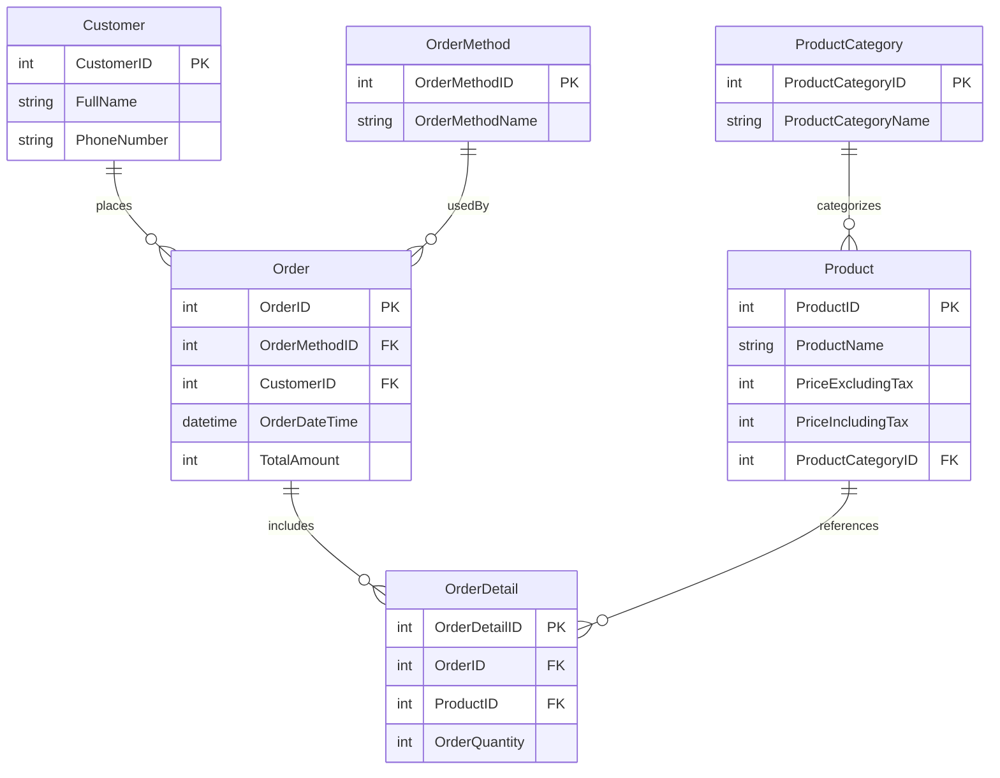

```mermaid
erDiagram

    Product {
        int ProductID PK
        string ProductName
        int PriceExcludingTax
        int PriceIncludingTax
        int ProductCategoryID FK
    }

    ProductCategory {
        int ProductCategoryID PK
        string ProductCategoryName
    }

    Order {
        int OrderID PK
        int OrderMethodID FK
        int CustomerID FK
        datetime OrderDateTime
        int TotalAmount
    }

    OrderDetail {
        int OrderDetailID PK
        int OrderID FK
        int ProductID FK
        int OrderQuantity
    }

    Customer {
        int CustomerID PK
        string FullName
        string PhoneNumber
    }

    OrderMethod {
        int OrderMethodID PK
        string OrderMethodName
    }

    ProductCategory ||--o{ Product : categorizes
    Customer ||--o{ Order : places
    OrderMethod ||--o{ Order : usedBy
    Order ||--o{ OrderDetail : includes
    Product ||--o{ OrderDetail : references
```
