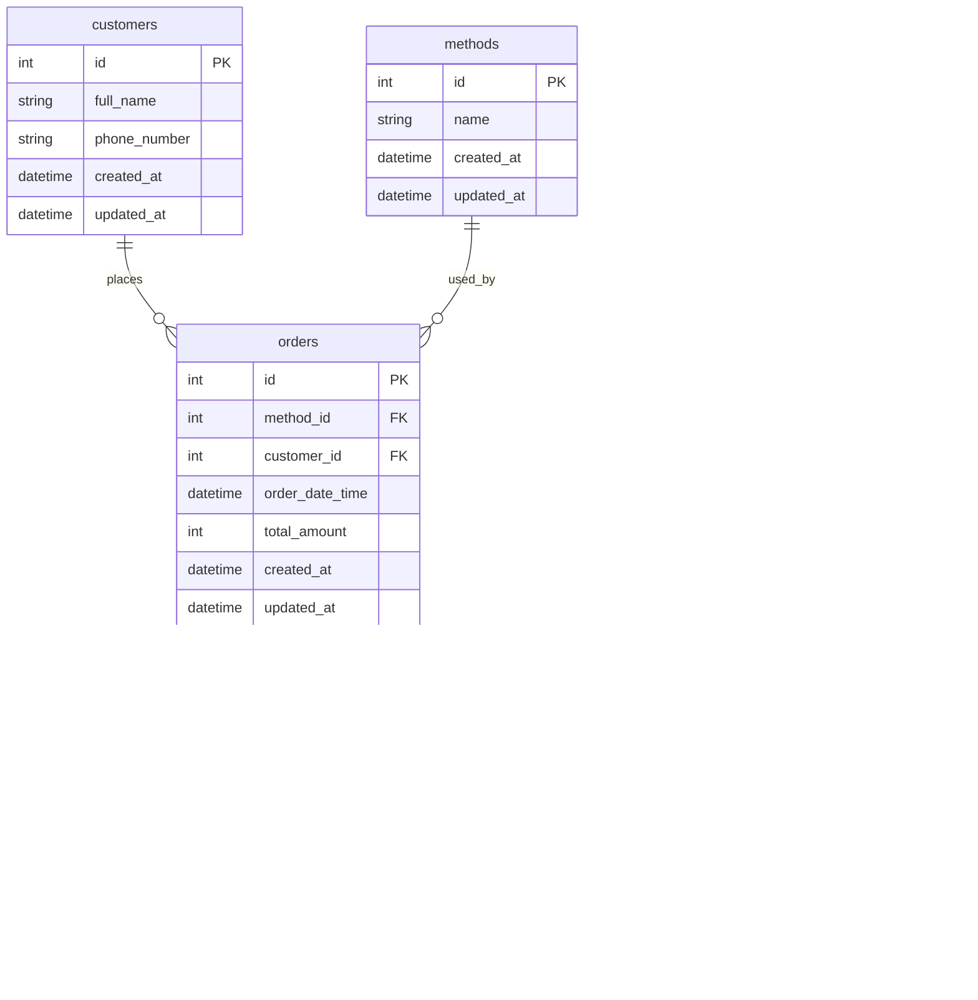

```mermaid
erDiagram

    products {
        int id PK
        string name
        int price_excluding_tax
        int price_including_tax
        int category_id FK
        datetime created_at
        datetime updated_at
    }

    categories {
        int id PK
        string name
        datetime created_at
        datetime updated_at
    }

    orders {
        int id PK
        int method_id FK
        int customer_id FK
        datetime order_date_time
        int total_amount
        datetime created_at
        datetime updated_at
    }

    details {
        int id PK
        int order_id FK
        int product_id FK
        int order_quantity
        datetime created_at
        datetime updated_at
    }

    customers {
        int id PK
        string full_name
        string phone_number
        datetime created_at
        datetime updated_at
    }

    methods {
        int id PK
        string name
        datetime created_at
        datetime updated_at
    }

    categories ||--o{ products : categorizes
    customers ||--o{ orders : places
    methods ||--o{ orders : used_by
    orders ||--o{ details : includes
    products ||--o{ details : references
```
