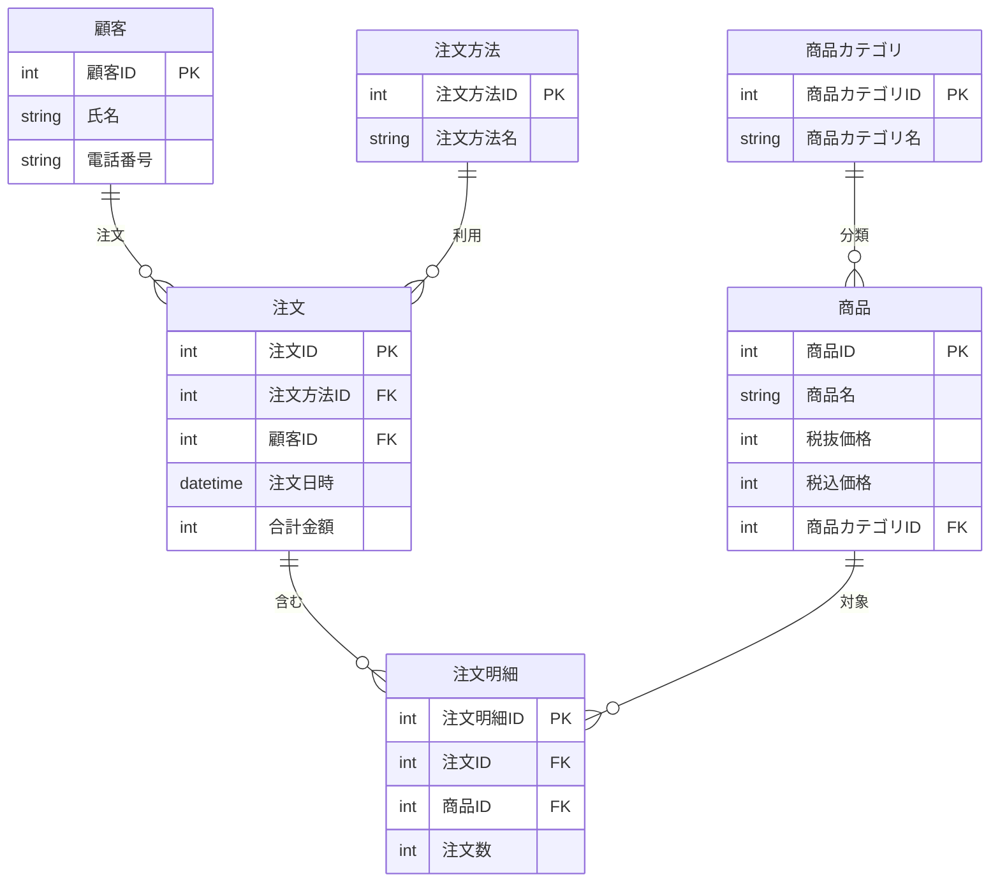

```mermaid
erDiagram

    商品 {
        int 商品ID PK
        string 商品名
        int 税抜価格
        int 税込価格
        int 商品カテゴリID FK
    }

    商品カテゴリ {
        int 商品カテゴリID PK
        string 商品カテゴリ名
    }

    注文 {
        int 注文ID PK
        int 注文方法ID FK
        int 顧客ID FK
        datetime 注文日時
        int 合計金額
    }

    注文明細 {
        int 注文明細ID PK
        int 注文ID FK
        int 商品ID FK
        int 注文数
    }

    顧客 {
        int 顧客ID PK
        string 氏名
        string 電話番号
    }

    注文方法 {
        int 注文方法ID PK
        string 注文方法名
    }

    商品カテゴリ ||--o{ 商品 : 分類
    顧客 ||--o{ 注文 : 注文
    注文方法 ||--o{ 注文 : 利用
    注文 ||--o{ 注文明細 : 含む
    商品 ||--o{ 注文明細 : 対象
```
