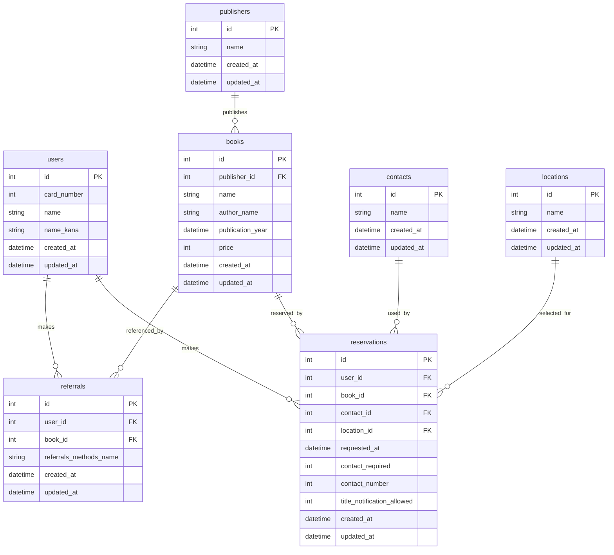

```mermaid
erDiagram

  reservations {
    int id PK
    int user_id FK
    int book_id FK
    int contact_id FK
    int location_id FK
    datetime requested_at
    int contact_required
    int contact_number
    int title_notification_allowed
    datetime created_at
    datetime updated_at
  }

  users {
    int id PK
    int card_number
    string name
    string name_kana
    datetime created_at
    datetime updated_at
  }

  books {
    int id PK
    int publisher_id FK
    string name
    string author_name
    datetime publication_year
    int price
    datetime created_at
    datetime updated_at
  }

  publishers {
    int id PK
    string name
    datetime created_at
    datetime updated_at
  }

  contacts {
    int id PK
    string name
    datetime created_at
    datetime updated_at
  }

  referrals {
    int id PK
    int user_id FK
    int book_id FK
    string referrals_methods_name
    datetime created_at
    datetime updated_at
  }

  locations {
    int id PK
    string name
    datetime created_at
    datetime updated_at
  }

  users ||--o{ reservations : makes
  books ||--o{ reservations : reserved_by
  publishers ||--o{ books : publishes
  contacts ||--o{ reservations : used_by
  locations ||--o{ reservations : selected_for
  users ||--o{ referrals : makes
  books ||--o{ referrals : referenced_by
```
