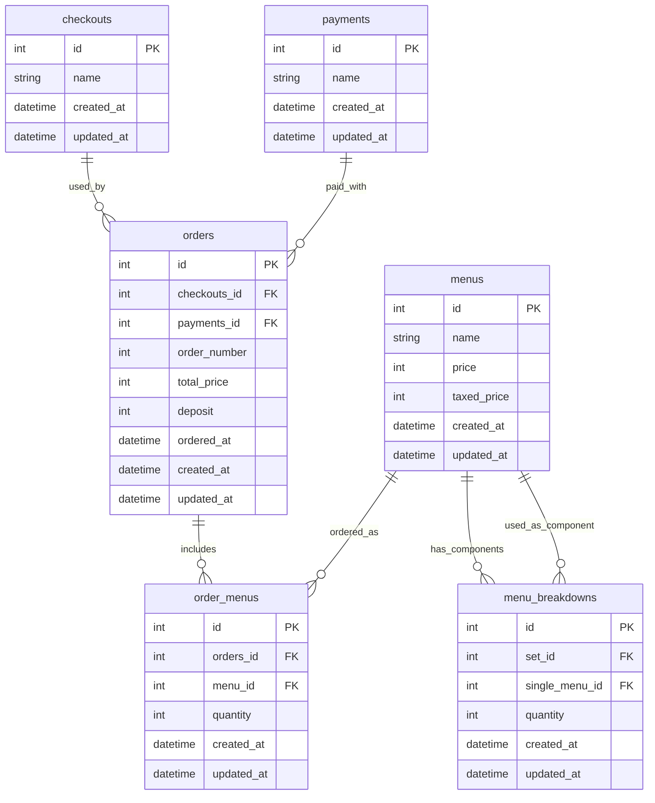

```mermaid
erDiagram

  orders {
    int id PK
    int checkouts_id FK
    int payments_id FK
    int order_number
    int total_price
    int deposit
    datetime ordered_at
    datetime created_at
    datetime updated_at
  }

  payments {
    int id PK
    string name 
    datetime created_at
    datetime updated_at
  }

  order_menus {
    int id PK
    int orders_id FK
    int menu_id FK
    int quantity
    datetime created_at
    datetime updated_at
  }

  menus {
    int id PK
    string name
    int price
    int taxed_price
    datetime created_at
    datetime updated_at
  }

  menu_breakdowns {
    int id PK
    int set_id FK
    int single_menu_id FK
    int quantity
    datetime created_at
    datetime updated_at
  }

  checkouts {
    int id PK
    string name 
    datetime created_at
    datetime updated_at
  }

  checkouts ||--o{ orders : used_by
  payments ||--o{ orders : paid_with
  orders ||--o{ order_menus : includes
  menus ||--o{ order_menus : ordered_as
  menus ||--o{ menu_breakdowns : has_components
  menus ||--o{ menu_breakdowns : used_as_component
```
