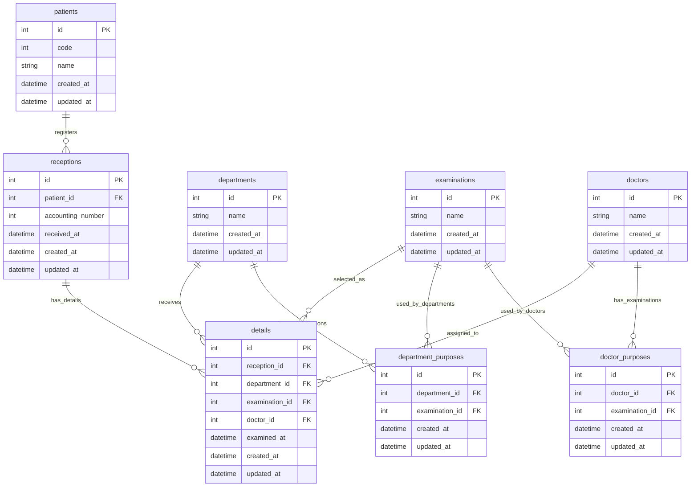

```mermaid
erDiagram

  receptions {
    int id PK
    int patient_id FK
    int accounting_number
    datetime received_at
    datetime created_at
    datetime updated_at
  }

  details {
    int id PK
    int reception_id FK
    int department_id FK
    int examination_id FK
    int doctor_id FK
    datetime examined_at
    datetime created_at
    datetime updated_at
  }

  patients {
    int id PK
    int code
    string name
    datetime created_at
    datetime updated_at
  }

  departments {
    int id PK
    string name
    datetime created_at
    datetime updated_at
  }

  department_purposes {
    int id PK
    int department_id FK
    int examination_id FK
    datetime created_at
    datetime updated_at
  }

  examinations {
    int id PK
    string name
    datetime created_at
    datetime updated_at
  }

  doctor_purposes {
    int id PK
    int doctor_id FK
    int examination_id FK
    datetime created_at
    datetime updated_at
  }

  doctors {
    int id PK
    string name
    datetime created_at
    datetime updated_at
  }


  patients ||--o{ receptions : registers
  receptions ||--o{ details : has_details
  departments ||--o{ details : receives
  examinations ||--o{ details : selected_as
  doctors ||--o{ details : assigned_to
  departments ||--o{ department_purposes : has_examinations
  examinations ||--o{ department_purposes : used_by_departments
  doctors ||--o{ doctor_purposes : has_examinations
  examinations ||--o{ doctor_purposes : used_by_doctors

```
