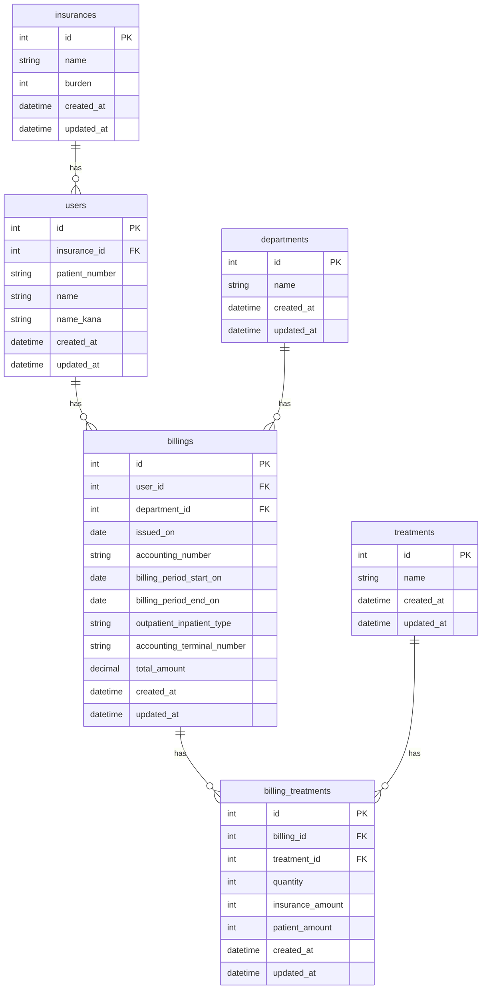

## テーブル設計書

### billings（請求テーブル）

| カラム名 | 型 | キー | 説明 |
| --- | --- | --- | --- |
| id | int | PK | 請求ID |
| user_id | int | FK | ユーザーID |
| department_id | int | FK | 科ID |
| issued_on | date |  | 発行日 |
| accounting_number | string |  | 会計番号 |
| billing_period_start_on | date |  | 請求期間開始日 |
| billing_period_end_on | date |  | 請求期間終了日 |
| outpatient_inpatient_type | string |  | 外来入院区分 |
| accounting_terminal_number | string |  | 会計端末番号 |
| total_amount | decimal |  | 合計金額 |
| created_at | datetime |  | 作成日時 |
| updated_at | datetime |  | 更新日時 |

### billing_treatments（請求治療内容テーブル）

| カラム名 | 型 | キー | 説明 |
| --- | --- | --- | --- |
| id | int | PK | 請求治療内容ID |
| billing_id | int | FK | 請求ID |
| treatment_id | int | FK | 治療内容ID |
| quantity | int |  | 点数 |
| insurance_amount | int |  | 保険費 |
| patient_amount | int |  | 自費 |
| created_at | datetime |  | 作成日時 |
| updated_at | datetime |  | 更新日時 |

### treatments（治療内容テーブル）

| カラム名 | 型 | キー | 説明 |
| --- | --- | --- | --- |
| id | int | PK | 治療内容ID |
| name | string |  | 治療名 |
| created_at | datetime |  | 作成日時 |
| updated_at | datetime |  | 更新日時 |

### users（ユーザーテーブル）

| カラム名 | 型 | キー | 説明 |
| --- | --- | --- | --- |
| id | int | PK | ユーザーID |
| insurance_id | int | FK | 保険区分ID |
| patient_number | string |  | 患者番号 |
| name | string |  | 氏名 |
| name_kana | string |  | 氏名カナ |
| created_at | datetime |  | 作成日時 |
| updated_at | datetime |  | 更新日時 |

### departments（科テーブル）

| カラム名 | 型 | キー | 説明 |
| --- | --- | --- | --- |
| id | int | PK | 科ID |
| name | string |  | 科名 |
| created_at | datetime |  | 作成日時 |
| updated_at | datetime |  | 更新日時 |

### insurances（保険区分テーブル）

| カラム名 | 型 | キー | 説明 |
| --- | --- | --- | --- |
| id | int | PK | 保険区分ID |
| name | string |  | 保険区分 |
| burden | int |  | 保険負担 |
| created_at | datetime |  | 作成日時 |
| updated_at | datetime |  | 更新日時 |
