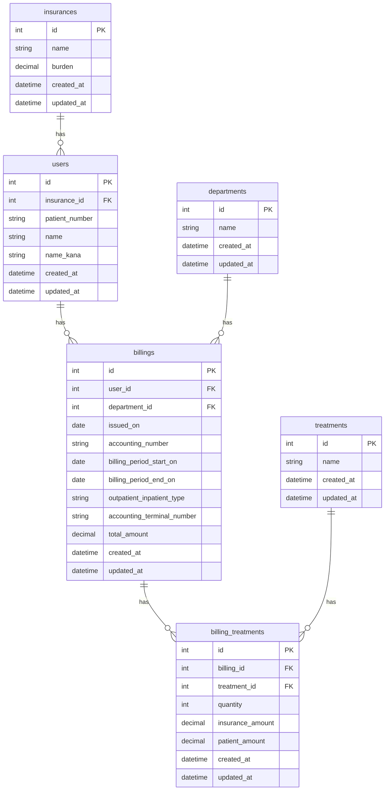

```mermaid
erDiagram
    users ||--o{ billings : has
    departments ||--o{ billings : has
    insurances ||--o{ users : has
    billings ||--o{ billing_treatments : has
    treatments ||--o{ billing_treatments : has

    billings {
        int id PK
        int user_id FK
        int department_id FK
        date issued_on
        string accounting_number
        date billing_period_start_on
        date billing_period_end_on
        string outpatient_inpatient_type
        string accounting_terminal_number
        decimal total_amount
        datetime created_at
        datetime updated_at
    }

    billing_treatments {
        int id PK
        int billing_id FK
        int treatment_id FK
        int quantity
        decimal insurance_amount
        decimal patient_amount
        datetime created_at
        datetime updated_at
    }

    treatments {
        int id PK
        string name
        datetime created_at
        datetime updated_at
    }

    users {
        int id PK
        int insurance_id FK
        string patient_number
        string name
        string name_kana
        datetime created_at
        datetime updated_at
    }

    departments {
        int id PK
        string name
        datetime created_at
        datetime updated_at
    }

    insurances {
        int id PK
        string name
        decimal burden
        datetime created_at
        datetime updated_at
    }
```
